```mermaid
flowchart LR
    A[Check Folders] --> B{Empty?}
    B -->|Yes| C[✅ Pass]
    B -->|No| D[Delete Contents]
    D --> E[✅ Cleared]
```

```mermaid
flowchart LR
    A[Check C:\ProgramData\Microsoft\User Account Pictures] --> B{Has 1+ files?}
    B -->|Yes| C[✅ Pass]
    B -->|No| D[Copy from Assets]
    D --> E[✅ Files Present]
```

```mermaid
flowchart LR
    A[🔗 Live Better U] --> B[Edge Kiosk]
    B --> C[https://wmlink.wal-mart.com/livebetteru]
```

```mermaid
flowchart LR
    A[🔗 Time Adjustment] --> B[Edge Kiosk]
    B --> C[https://wmlink.wal-mart.com/eta]
```

```mermaid
flowchart LR
    A[🔗 Two-Step Verification] --> B[Edge Kiosk]
    B --> C[https://svipreg.wal-mart.com]
```

```mermaid
flowchart LR
    A[🔗 ULearn] --> B[Edge Kiosk]
    B --> C[https://wmlink.wal-mart.com/ULearn]
```

```mermaid
flowchart LR
    A[🗝️ HKLM:\SOFTWARE\Policies\Microsoft\Windows\Explorer] --> B[HideRecommendedSection]
    B --> C["1"]
```

```mermaid
flowchart LR
    A[🗝️ HKLM:\SOFTWARE\Microsoft\Windows NT\CurrentVersion\Winlogon] --> B[AutoAdminLogon]
    B --> C["1"]
```

```mermaid
flowchart LR
    A[🗝️ HKLM:\SOFTWARE\Microsoft\Windows NT\CurrentVersion\Winlogon] --> B[ForceAutoLogon]
    B --> C["1"]
```

# US_CBL Summary

## Overview

| Property | Value |
|----------|-------|
| Role | US_CBL |
| Version | 1.0.0 |
| Description | US Computer Based Learning kiosk configuration |
| Author | Joshua Walderbach |
| Last Modified | 2025-12-03 |
| Total Checks | 24 |

## Process Flow


## Checks by Type

| Type | Count | Icon |
|------|-------|------|
| ApplicationNotInstalled | 1 | ❌ |
| AssignedAccess | 1 | 🖥️ |
| DriverInstalled | 1 | 🔧 |
| FileContent | 1 | 📄 |
| FilesExist | 1 | 📄 |
| FolderEmpty | 1 | 📁 |
| FolderHasFiles | 1 | 📁 |
| PrinterInstalled | 1 | 🖨️ |
| RegistryValue | 3 | 🗝️ |
| ScheduledTaskExists | 1 | ⏰ |
| ShortcutExists | 10 | 🔗 |
| ShortcutsAllowList | 1 | 🔗 |
| UserRegistryValue | 1 | 🗝️ |

## Dependencies & Execution Order

Checks are processed in the order listed below. Notable dependencies:

- **Driver → Printer:** Printer drivers must be installed before printers can be added
- **Script → Task:** Script files should exist before scheduled tasks reference them
- **Icons → Shortcuts:** Icon files should exist before shortcuts reference them

---

## Check Details

### 1. ❌ Google Chrome Not Installed
**Type:** `ApplicationNotInstalled`  
**ID:** `chrome-not-installed`  
**Enabled:** Yes


**Detection:**
Searches for application in:
- `C:\Program Files*\Google\Chrome\Application\chrome.exe`
- `C:\Users\*\AppData\Local\Google\Chrome\Application\chrome.exe`

**Remediation:**
Runs uninstaller from:
- `C:\Program Files*\Google\Chrome\Application\*\Installer\setup.exe`
- `C:\Users\*\AppData\Local\Google\Chrome\Application\*\Installer\setup.exe`

Arguments: `--uninstall --multi-install --chrome --system-level --force-uninstall`

---

### 2. 📁 Desktop Folders Cleared
**Type:** `FolderEmpty`  
**ID:** `desktop-folders-empty`  
**Enabled:** Yes



**Detection:**
Checks if these folders are empty:
- `$env:PUBLIC\Desktop`
- `$env:USERPROFILE\Desktop`

*Also checks all user profile folders*

**Remediation:**
Deletes all files and subfolders from the listed paths.

---

### 3. 🔗 Start Menu Contains Only Allowed Shortcuts
**Type:** `ShortcutsAllowList`  
**ID:** `start-menu-allowed-shortcuts`  
**Enabled:** Yes

**Detection:**
Scans `C:\ProgramData\Microsoft\Windows\Start Menu\Programs` for shortcuts.

**Allowed Shortcuts:**
| Shortcut | Status |
|----------|--------|
| GTA Time Clock.lnk | ✅ Allowed |
| Live Better U.lnk | ✅ Allowed |
| OneWalmart.lnk | ✅ Allowed |
| On-Screen Keyboard.lnk | ✅ Allowed |
| Time Adjustment.lnk | ✅ Allowed |
| Two-Step Verification.lnk | ✅ Allowed |
| ULearn.lnk | ✅ Allowed |
| Volume.lnk | ✅ Allowed |
| Walmart Academy.lnk | ✅ Allowed |
| Walmart Careers.lnk | ✅ Allowed |

**Remediation:**
Deletes any shortcuts NOT in the allowed list.

---

### 4. 📁 User Account Pictures Present
**Type:** `FolderHasFiles`  
**ID:** `user-account-pictures-exist`  
**Enabled:** Yes



**Detection:**
- Path: `C:\ProgramData\Microsoft\User Account Pictures`
- Minimum Files Required: 1

**Remediation:**
- Copies files from: `Assets\AccountPictures`

---

### 5. 📄 Icon Files Present
**Type:** `FilesExist`  
**ID:** `icon-files-exist`  
**Enabled:** Yes

**Detection:**
Checks if these files exist in `C:\Walmart Applications\Desktop Icons`:

| File | Status |
|------|--------|
| `GTA_Time_Clock.ico` | Required |
| `Live_Better_U.ico` | Required |
| `OneWalmart.ico` | Required |
| `Time_Adjustment.ico` | Required |
| `Two-Step_Verification.ico` | Required |
| `ULearn.ico` | Required |
| `Walmart_Academy.ico` | Required |
| `Walmart_Careers.ico` | Required |

**Remediation:**
Copies missing files from `Assets\Icons`

---

### 6. 🔗 GTA Time Clock Shortcut
**Type:** `ShortcutExists`  
**ID:** `gta-time-clock-shortcut`  
**Enabled:** Yes


**Shortcut Details:**
| Property | Value |
|----------|-------|
| Path | `C:\ProgramData\Microsoft\Windows\Start Menu\Programs\GTA Time Clock.lnk` |
| Target | `C:\Program Files (x86)\Microsoft\Edge\Application\msedge.exe` |
| Arguments | `--no-first-run --kiosk http://timeclock.walmart.com --edge-kiosk-type=public-browsing` |
| Icon | `C:\Walmart Applications\Desktop Icons\GTA_Time_Clock.ico` |
| Description | GTA Time Clock |

**Remediation:**
Creates or updates the shortcut with the specified properties.

---

### 7. 🔗 Live Better U Shortcut
**Type:** `ShortcutExists`  
**ID:** `live-better-u-shortcut`  
**Enabled:** Yes



**Shortcut Details:**
| Property | Value |
|----------|-------|
| Path | `C:\ProgramData\Microsoft\Windows\Start Menu\Programs\Live Better U.lnk` |
| Target | `C:\Program Files (x86)\Microsoft\Edge\Application\msedge.exe` |
| Arguments | `--no-first-run --kiosk https://wmlink.wal-mart.com/livebetteru --edge-kiosk-type=public-browsing` |
| Icon | `C:\Walmart Applications\Desktop Icons\Live_Better_U.ico` |
| Description | Live Better U |

**Remediation:**
Creates or updates the shortcut with the specified properties.

---

### 8. 🔗 OneWalmart Shortcut
**Type:** `ShortcutExists`  
**ID:** `onewalmart-shortcut`  
**Enabled:** Yes


**Shortcut Details:**
| Property | Value |
|----------|-------|
| Path | `C:\ProgramData\Microsoft\Windows\Start Menu\Programs\OneWalmart.lnk` |
| Target | `C:\Program Files (x86)\Microsoft\Edge\Application\msedge.exe` |
| Arguments | `--no-first-run --kiosk https://wmlink.wal-mart.com/Wire --edge-kiosk-type=public-browsing` |
| Icon | `C:\Walmart Applications\Desktop Icons\OneWalmart.ico` |
| Description | OneWalmart |

**Remediation:**
Creates or updates the shortcut with the specified properties.

---

### 9. 🔗 On-Screen Keyboard Shortcut
**Type:** `ShortcutExists`  
**ID:** `on-screen-keyboard-shortcut`  
**Enabled:** Yes


**Shortcut Details:**
| Property | Value |
|----------|-------|
| Path | `C:\ProgramData\Microsoft\Windows\Start Menu\Programs\On-Screen Keyboard.lnk` |
| Target | `C:\Windows\System32\osk.exe` |
| Icon | `C:\Windows\System32\osk.exe` |
| Description | On-Screen Keyboard |

**Remediation:**
Creates or updates the shortcut with the specified properties.

---

### 10. 🔗 Time Adjustment Shortcut
**Type:** `ShortcutExists`  
**ID:** `time-adjustment-shortcut`  
**Enabled:** Yes



**Shortcut Details:**
| Property | Value |
|----------|-------|
| Path | `C:\ProgramData\Microsoft\Windows\Start Menu\Programs\Time Adjustment.lnk` |
| Target | `C:\Program Files (x86)\Microsoft\Edge\Application\msedge.exe` |
| Arguments | `--no-first-run --kiosk https://wmlink.wal-mart.com/eta --edge-kiosk-type=public-browsing` |
| Icon | `C:\Walmart Applications\Desktop Icons\Time_Adjustment.ico` |
| Description | Time Adjustment |

**Remediation:**
Creates or updates the shortcut with the specified properties.

---

### 11. 🔗 Two-Step Verification Shortcut
**Type:** `ShortcutExists`  
**ID:** `two-step-verification-shortcut`  
**Enabled:** Yes



**Shortcut Details:**
| Property | Value |
|----------|-------|
| Path | `C:\ProgramData\Microsoft\Windows\Start Menu\Programs\Two-Step Verification.lnk` |
| Target | `C:\Program Files (x86)\Microsoft\Edge\Application\msedge.exe` |
| Arguments | `--no-first-run --kiosk https://svipreg.wal-mart.com --edge-kiosk-type=public-browsing` |
| Icon | `C:\Walmart Applications\Desktop Icons\Two-Step_Verification.ico` |
| Description | Two-Step Verification |

**Remediation:**
Creates or updates the shortcut with the specified properties.

---

### 12. 🔗 ULearn Shortcut
**Type:** `ShortcutExists`  
**ID:** `ulearn-shortcut`  
**Enabled:** Yes



**Shortcut Details:**
| Property | Value |
|----------|-------|
| Path | `C:\ProgramData\Microsoft\Windows\Start Menu\Programs\ULearn.lnk` |
| Target | `C:\Program Files (x86)\Microsoft\Edge\Application\msedge.exe` |
| Arguments | `--no-first-run --kiosk https://wmlink.wal-mart.com/ULearn --edge-kiosk-type=public-browsing` |
| Icon | `C:\Walmart Applications\Desktop Icons\ULearn.ico` |
| Description | ULearn |

**Remediation:**
Creates or updates the shortcut with the specified properties.

---

### 13. 🔗 Volume Shortcut
**Type:** `ShortcutExists`  
**ID:** `volume-shortcut`  
**Enabled:** Yes


**Shortcut Details:**
| Property | Value |
|----------|-------|
| Path | `C:\ProgramData\Microsoft\Windows\Start Menu\Programs\Volume.lnk` |
| Target | `C:\Windows\System32\SndVol.exe` |
| Icon | `C:\Windows\System32\SndVol.exe` |
| Description | Volume |

**Remediation:**
Creates or updates the shortcut with the specified properties.

---

### 14. 🔗 Walmart Academy Shortcut
**Type:** `ShortcutExists`  
**ID:** `walmart-academy-shortcut`  
**Enabled:** Yes


**Shortcut Details:**
| Property | Value |
|----------|-------|
| Path | `C:\ProgramData\Microsoft\Windows\Start Menu\Programs\Walmart Academy.lnk` |
| Target | `C:\Program Files (x86)\Microsoft\Edge\Application\msedge.exe` |
| Arguments | `--no-first-run --kiosk https://academy.walmart.com/home --edge-kiosk-type=public-browsing` |
| Icon | `C:\Walmart Applications\Desktop Icons\Walmart_Academy.ico` |
| Description | Walmart Academy |

**Remediation:**
Creates or updates the shortcut with the specified properties.

---

### 15. 🔗 Walmart Careers Shortcut
**Type:** `ShortcutExists`  
**ID:** `walmart-careers-shortcut`  
**Enabled:** Yes


**Shortcut Details:**
| Property | Value |
|----------|-------|
| Path | `C:\ProgramData\Microsoft\Windows\Start Menu\Programs\Walmart Careers.lnk` |
| Target | `C:\Program Files (x86)\Microsoft\Edge\Application\msedge.exe` |
| Arguments | `--no-first-run --kiosk https://careers.walmart.com/ --edge-kiosk-type=public-browsing` |
| Icon | `C:\Walmart Applications\Desktop Icons\Walmart_Careers.ico` |
| Description | Walmart Careers |

**Remediation:**
Creates or updates the shortcut with the specified properties.

---

### 16. 🖥️ Assigned Access Kiosk Mode
**Type:** `AssignedAccess`  
**ID:** `assigned-access-configured`  
**Enabled:** Yes

```mermaid
flowchart TD
    subgraph Kiosk["🖥️ US CBL Kiosk"]
        subgraph Apps["Allowed Applications"]
            A0[C:\Program Files (x86)\Microsoft\Edge\Application\msedge]
            A1[C:\Program Files (x86)\Microsoft\EdgeUpdate\MicrosoftEdgeUpdate]
            A2[C:\Windows\System32\osk]
            A3[C:\Windows\System32\sndvol]
            A4[%PROGRAMFILES%\MCAFEE\DLP\AGENT\FCAG]
            A5[%PROGRAMFILES%\WEBSENSE\WEBSENSE ENDPOINT\F1EUI]
            A6[C:\Walmart Applications\bginfo\bginfo]
        end
        subgraph Pins["Start Menu Pins"]
            P0[%ALLUSERSPROFILE%\Microsoft\Windows\Start Menu\Programs\GTA Time Clock]
            P1[%ALLUSERSPROFILE%\Microsoft\Windows\Start Menu\Programs\Live Better U]
            P2[%ALLUSERSPROFILE%\Microsoft\Windows\Start Menu\Programs\OneWalmart]
            P3[%ALLUSERSPROFILE%\Microsoft\Windows\Start Menu\Programs\On-Screen Keyboard]
            P4[%ALLUSERSPROFILE%\Microsoft\Windows\Start Menu\Programs\Time Adjustment]
            P99[...and 5 more]
        end
    end
```

**Configuration:**
| Property | Value |
|----------|-------|
| Profile ID | `{2deb1110-8a3e-4de5-a2e4-fe3d4990ef4d}` |
| Display Name | US CBL Kiosk |
| Show Taskbar | Yes |

**Allowed Applications:**
- `C:\Program Files (x86)\Microsoft\Edge\Application\msedge.exe`
- `C:\Program Files (x86)\Microsoft\EdgeUpdate\MicrosoftEdgeUpdate.exe`
- `C:\Windows\System32\osk.exe`
- `C:\Windows\System32\sndvol.exe`
- `%PROGRAMFILES%\MCAFEE\DLP\AGENT\FCAG.EXE`
- `%PROGRAMFILES%\WEBSENSE\WEBSENSE ENDPOINT\F1EUI.EXE`
- `C:\Walmart Applications\bginfo\bginfo.exe`

**Start Menu Pins:**
- `%ALLUSERSPROFILE%\Microsoft\Windows\Start Menu\Programs\GTA Time Clock.lnk`
- `%ALLUSERSPROFILE%\Microsoft\Windows\Start Menu\Programs\Live Better U.lnk`
- `%ALLUSERSPROFILE%\Microsoft\Windows\Start Menu\Programs\OneWalmart.lnk`
- `%ALLUSERSPROFILE%\Microsoft\Windows\Start Menu\Programs\On-Screen Keyboard.lnk`
- `%ALLUSERSPROFILE%\Microsoft\Windows\Start Menu\Programs\Time Adjustment.lnk`
- `%ALLUSERSPROFILE%\Microsoft\Windows\Start Menu\Programs\Two-Step Verification.lnk`
- `%ALLUSERSPROFILE%\Microsoft\Windows\Start Menu\Programs\ULearn.lnk`
- `%ALLUSERSPROFILE%\Microsoft\Windows\Start Menu\Programs\Volume.lnk`
- `%ALLUSERSPROFILE%\Microsoft\Windows\Start Menu\Programs\Walmart Academy.lnk`
- `%ALLUSERSPROFILE%\Microsoft\Windows\Start Menu\Programs\Walmart Careers.lnk`

**Remediation:**
Applies Assigned Access XML configuration via WMI MDM_AssignedAccess class.

⚠️ *Requires SYSTEM privileges*

---

### 17. 🗝️ Hide Start Menu Recommended Section
**Type:** `RegistryValue`  
**ID:** `hide-recommended-section`  
**Enabled:** Yes



**Registry Details:**
| Property | Value |
|----------|-------|
| Path | `HKLM:\SOFTWARE\Policies\Microsoft\Windows\Explorer` |
| Name | `HideRecommendedSection` |
| Value | `1` |
| Type | DWord |

**Remediation:**
Creates the registry key (if missing) and sets the value.

---

### 18. ⏰ ManifestManipulator Scheduled Task
**Type:** `ScheduledTaskExists`  
**ID:** `manifest-manipulator-task`  
**Enabled:** Yes



```mermaid
flowchart LR
    A[⏰ ManifestManipulator] --> B{Trigger: AtLogOn}
    B --> C[Run: Powershell.exe]
    C --> D[As: NT AUTHORITY\SYSTEM]
```

**Task Details:**
| Property | Value |
|----------|-------|
| Task Name | `ManifestManipulator` |
| Task Path | `\` |
| Execute | `Powershell.exe` |
| Arguments | `-ExecutionPolicy Bypass -NonInteractive -NoLogo -NoProfile -File C:\Windows\Packagelogs\Customizations\ManifestManipulator.ps1` |
| Trigger | AtLogOn |
| Run Level | Highest |
| Principal | `NT AUTHORITY\SYSTEM` |

**Remediation:**
Creates the scheduled task with specified trigger and action.

---

### 19. 📄 ManifestManipulator Script File
**Type:** `FileContent`  
**ID:** `manifest-manipulator-script`  
**Enabled:** Yes


**File Details:**
| Property | Value |
|----------|-------|
| Destination | `C:\Windows\Packagelogs\Customizations\ManifestManipulator.ps1` |
| Source | `Assets\Scripts\ManifestManipulator.ps1` |

**Remediation:**
Copies the file from Assets to the destination path.

---

### 20. 🗝️ Auto-Logon Configuration
**Type:** `RegistryValue`  
**ID:** `auto-logon-enabled`  
**Enabled:** Yes



**Registry Details:**
| Property | Value |
|----------|-------|
| Path | `HKLM:\SOFTWARE\Microsoft\Windows NT\CurrentVersion\Winlogon` |
| Name | `AutoAdminLogon` |
| Value | `1` |
| Type | String |

**Remediation:**
Creates the registry key (if missing) and sets the value.

---

### 21. 🗝️ Force Auto-Logon
**Type:** `RegistryValue`  
**ID:** `force-auto-logon`  
**Enabled:** Yes



**Registry Details:**
| Property | Value |
|----------|-------|
| Path | `HKLM:\SOFTWARE\Microsoft\Windows NT\CurrentVersion\Winlogon` |
| Name | `ForceAutoLogon` |
| Value | `1` |
| Type | String |

**Remediation:**
Creates the registry key (if missing) and sets the value.

---

### 22. 🗝️ KioskUser0 Start Menu Pinned List Policy
**Type:** `UserRegistryValue`  
**ID:** `kioskuser0-pinned-list-policy`  
**Enabled:** Yes

```mermaid
flowchart LR
    A[👤 kioskUser0] --> B[Load Hive]
    B --> C[NoStartMenuPinnedList = "0"]
```

**User Registry Details:**
| Property | Value |
|----------|-------|
| Username | `kioskUser0` |
| Path | `Software\Microsoft\Windows\CurrentVersion\Policies\Explorer` |
| Name | `NoStartMenuPinnedList` |
| Value | `0` |
| Type | DWord |

**Remediation:**
Loads the user's registry hive (NTUSER.DAT) and sets the value.

---

### 23. 🔧 Lexmark Universal v2 XL
**Type:** `DriverInstalled`  
**ID:** `LexmarkPrinterDriver`  
**Enabled:** Yes

```mermaid
flowchart LR
    A[🔧 Lexmark Universal v2 XL] --> B{Installed?}
    B -->|Yes| C{Version OK?}
    B -->|No| D[Install Driver]
    C -->|Yes| E[✅ Pass]
    C -->|No| F[Update Driver]
    D --> E
    F --> E
```

**Driver Details:**
| Property | Value |
|----------|-------|
| Driver Name | `Lexmark Universal v2 XL` |
| Driver Class | Printer |
| Source | `Assets\Drivers\Lexmark_Universal_v2_UD1_XL\LMUD1p40.inf` |
| Minimum Version | 3.0.7.0 |

**Remediation:**
Installs driver using `pnputil /add-driver /install`
If version is too old, removes existing driver first.

---

### 24. 🖨️ Personnel Printer
**Type:** `PrinterInstalled`  
**ID:** `PersonnelPrinter`  
**Enabled:** Yes

```mermaid
flowchart LR
    A[🖨️ Personnel] --> B[mfpr01]
    B --> C[Port: mfpr01]
    C --> D[Driver: Lexmark Universal v2 XL]
```

**Printer Details:**
| Property | Value |
|----------|-------|
| Printer Name | `Personnel` |
| Driver | `Lexmark Universal v2 XL` |
| IP/Hostname | `mfpr01` |
| Port Name | `mfpr01` |
| Port Type | TCP |
| Set as Default | Yes |

**Remediation:**
Creates printer port (if missing) and adds printer with specified driver.

⚠️ *Driver must be installed before printer can be added*

---

---

*Generated by Configuration Blender on 2025-12-03*
