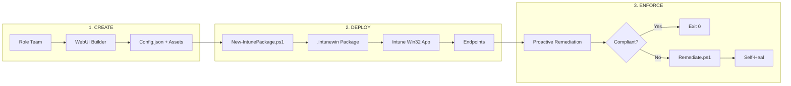
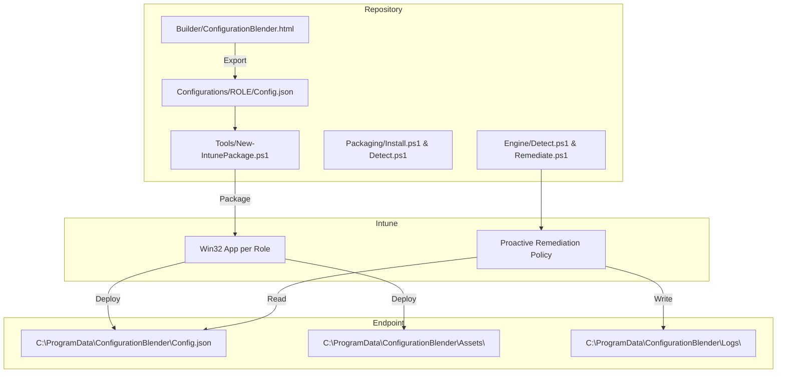
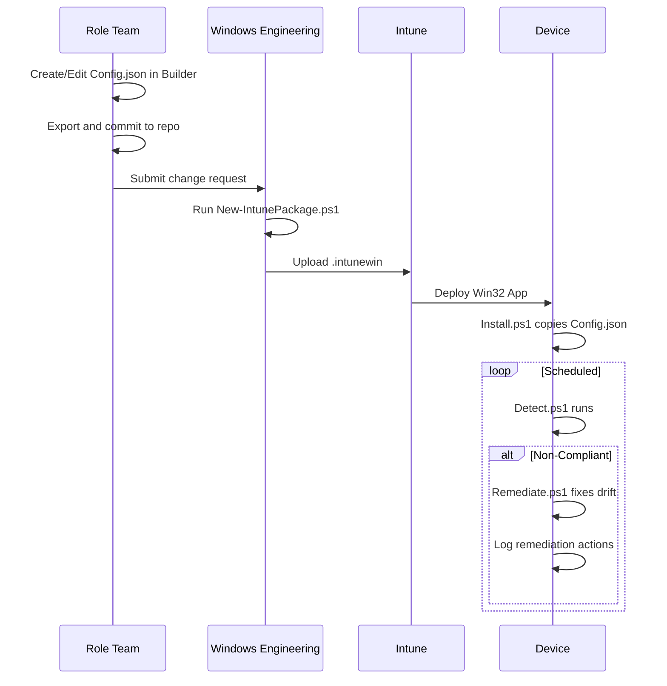
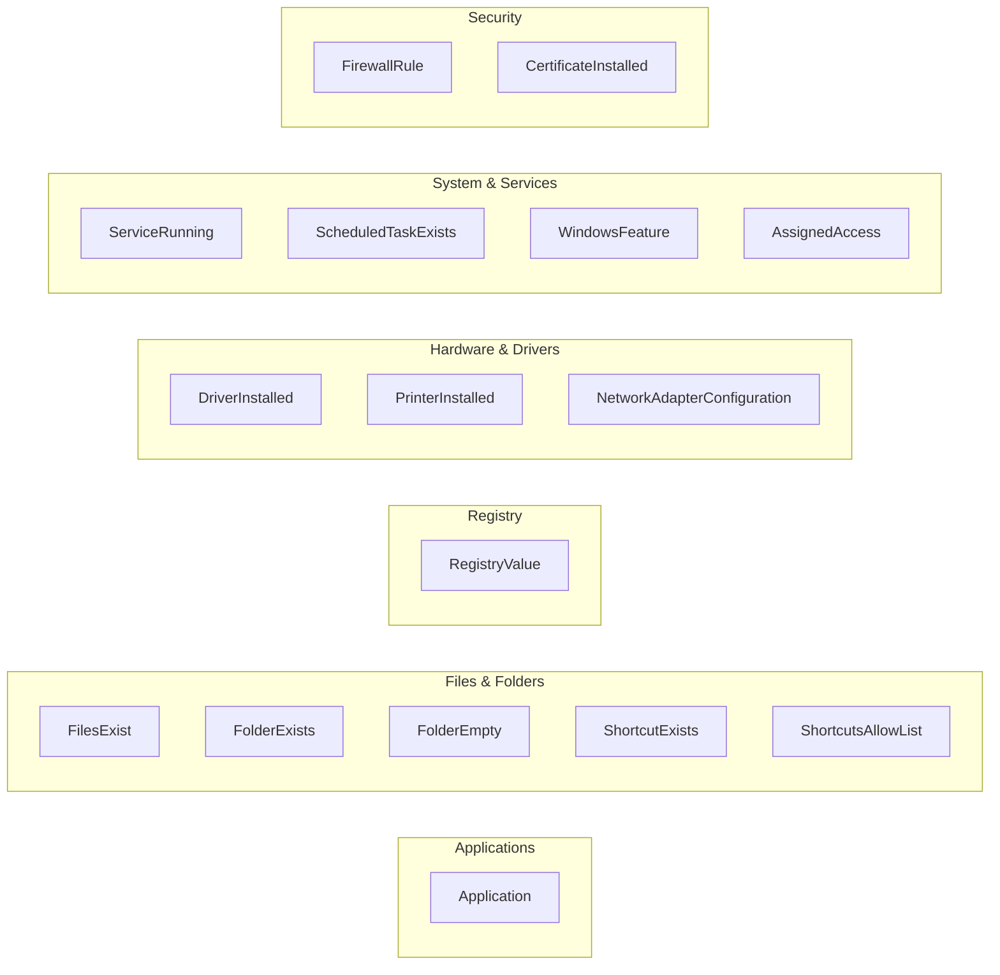
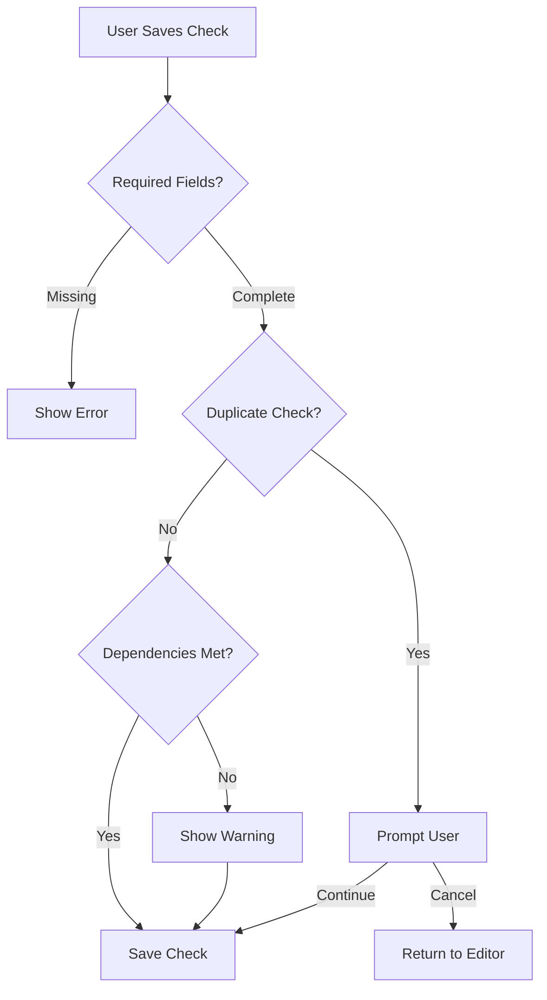
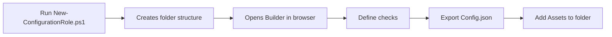
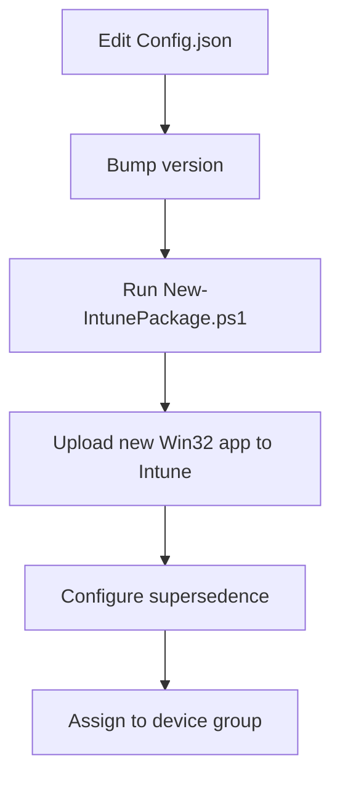
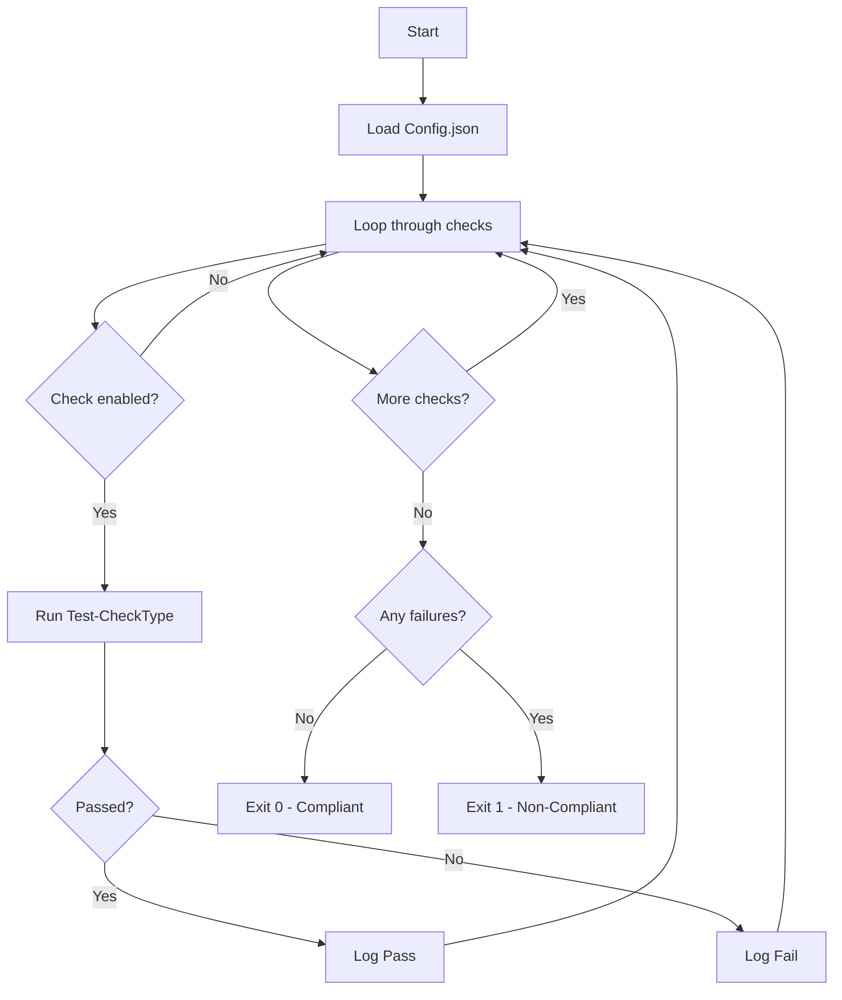
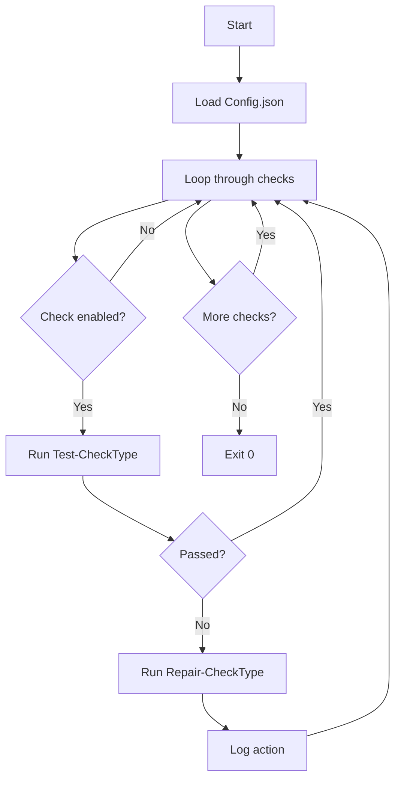
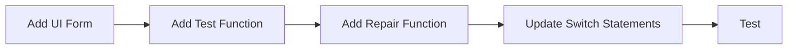

# Configuration Blender - Technical Documentation

> Comprehensive technical guide for engineers implementing and extending Configuration Blender.

---

## Table of Contents

- [Architecture Overview](#architecture-overview)
  - [Three-Stage Pipeline](#three-stage-pipeline)
  - [Component Diagram](#component-diagram)
  - [Data Flow](#data-flow)
- [Installation & Setup](#installation--setup)
  - [Prerequisites](#prerequisites)
  - [Repository Setup](#repository-setup)
  - [External Tools](#external-tools)
- [Configuration Builder (WebUI)](#configuration-builder-webui)
  - [Features](#features)
  - [Check Types Reference](#check-types-reference)
  - [Validation System](#validation-system)
- [Config.json Schema](#configjson-schema)
  - [Metadata Fields](#metadata-fields)
  - [Check Structure](#check-structure)
  - [Property Reference by Type](#property-reference-by-type)
- [Deployment Pipeline](#deployment-pipeline)
  - [Creating a Role Configuration](#creating-a-role-configuration)
  - [Packaging for Intune](#packaging-for-intune)
  - [Win32 App Settings](#win32-app-settings)
  - [Updating Configurations](#updating-configurations)
- [Engine Scripts](#engine-scripts)
  - [Detection (Detect.ps1)](#detection-detectps1)
  - [Remediation (Remediate.ps1)](#remediation-remediateps1)
  - [Execution Context](#execution-context)
- [File Paths & Registry](#file-paths--registry)
  - [Production Paths](#production-paths)
  - [Registry Keys](#registry-keys)
  - [Logging](#logging)
- [Testing](#testing)
  - [Local Testing](#local-testing)
  - [Testing as SYSTEM](#testing-as-system)
- [Extending Configuration Blender](#extending-configuration-blender)
  - [Adding New Check Types](#adding-new-check-types)
- [Troubleshooting](#troubleshooting)
  - [Common Issues](#common-issues)
  - [Log Analysis](#log-analysis)

---

## Architecture Overview

### Three-Stage Pipeline

Configuration Blender uses a three-stage pipeline to separate concerns between configuration definition, deployment, and enforcement.



### Component Diagram



### Data Flow



---

## Installation & Setup

### Prerequisites

- Windows 10/11 endpoint
- PowerShell 5.1+
- Microsoft Intune license
- Git (recommended)

### Repository Setup

**Option 1: Clone with Git**
```powershell
git clone https://github.com/YOUR_ORG/ConfigurationBlender.git
cd ConfigurationBlender
```

**Option 2: Download ZIP**
1. Download from GitHub
2. Extract to desired location

### External Tools

Download the Microsoft Win32 Content Prep Tool:

```powershell
Invoke-WebRequest -Uri "https://github.com/microsoft/Microsoft-Win32-Content-Prep-Tool/releases/latest/download/IntuneWinAppUtil.exe" `
                  -OutFile ".\Tools\IntuneWinAppUtil.exe"
```

---

## Configuration Builder (WebUI)

Open `Builder/ConfigurationBlender.html` in any modern browser.

### Features

| Feature | Description |
|---------|-------------|
| Visual Check Editor | Add/edit checks without writing JSON |
| Real-time JSON Preview | See generated Config.json as you build |
| Dependency Validation | Warns when checks require prerequisites |
| Import/Export | Load existing configs or export new ones |
| Dark Mode | Toggle between light and dark themes |
| Example Templates | Pre-built configurations for common scenarios |
| Keyboard Shortcuts | Ctrl+O (Import), Ctrl+S (Export), Ctrl+N (Add Check) |

### Check Types Reference



| Check Type | Purpose | Key Properties |
|------------|---------|----------------|
| `Application` | Install or remove applications | `applicationName`, `ensureInstalled`, `searchPaths`, `uninstallPaths` |
| `FilesExist` | Deploy single file or multiple files | `mode` (SingleFile/MultipleFiles), `destinationPath`, `sourceAssetPath` |
| `FolderExists` | Ensure folder exists with optional file count | `path`, `minimumFileCount`, `sourceAssetPath` |
| `FolderEmpty` | Ensure folder is empty | `paths`, `includeAllUserProfiles` |
| `ShortcutExists` | Create/verify shortcuts | `path`, `targetPath`, `arguments`, `iconLocation` |
| `ShortcutsAllowList` | Remove unauthorized shortcuts | `path`, `allowedShortcuts` |
| `RegistryValue` | Set registry values | `path`, `name`, `value`, `type` |
| `DriverInstalled` | Install device drivers | `driverName`, `driverClass`, `sourceAssetPath`, `minimumVersion` |
| `PrinterInstalled` | Configure network printers | `printerName`, `driverName`, `printerIP`, `portName`, `portType` |
| `NetworkAdapterConfiguration` | Configure network adapters | `adapterName`, `staticIPAddress`, `dnsServers` |
| `ServiceRunning` | Ensure services are running | `serviceName`, `startupType`, `ensureRunning` |
| `ScheduledTaskExists` | Create scheduled tasks | `taskName`, `execute`, `arguments`, `trigger`, `principal` |
| `WindowsFeature` | Enable/disable Windows features | `featureName`, `state` |
| `AssignedAccess` | Configure kiosk mode | `profileId`, `allowedApps`, `startPins`, `showTaskbar` |
| `FirewallRule` | Manage firewall rules | `ruleName`, `direction`, `action`, `protocol`, `remoteAddress` |
| `CertificateInstalled` | Deploy certificates | `thumbprint`, `subject`, `storeLocation`, `sourceAssetPath` |

### Validation System

The Builder validates configurations in real-time:



**Dependency Validation:**

| Check Type | Required Dependency |
|------------|---------------------|
| `PrinterInstalled` | `DriverInstalled` with matching driver name |
| `ShortcutExists` (with custom icon) | `FilesExist` deploying the icon file |
| `AssignedAccess` | `ShortcutExists` for each pinned shortcut |

---

## Config.json Schema

### Metadata Fields

```json
{
  "version": "1.0.0",
  "role": "US_CBL",
  "description": "US Computer Based Learning kiosk configuration",
  "author": "John Smith",
  "lastModified": "2025-12-03",
  "checks": []
}
```

| Field | Required | Description |
|-------|----------|-------------|
| `version` | Yes | Semantic version (X.Y.Z) |
| `role` | Yes | Role identifier (e.g., US_CBL, CA_MPC) |
| `description` | No | Human-readable description |
| `author` | No | Configuration author |
| `lastModified` | No | Last modification date (YYYY-MM-DD) |
| `checks` | Yes | Array of check objects |

### Check Structure

```json
{
  "id": "1",
  "name": "Human-readable name",
  "type": "CheckType",
  "enabled": true,
  "properties": {
    // Type-specific properties
  }
}
```

### Property Reference by Type

<details>
<summary><strong>Application</strong></summary>

```json
{
  "type": "Application",
  "properties": {
    "applicationName": "Google Chrome",
    "ensureInstalled": false,
    "searchPaths": [
      "C:\\Program Files*\\Google\\Chrome\\Application\\chrome.exe"
    ],
    "uninstallPaths": [
      "C:\\Program Files*\\Google\\Chrome\\Application\\*\\Installer\\setup.exe"
    ],
    "uninstallArguments": "--uninstall --force-uninstall",
    "installCommand": "winget install Google.Chrome",
    "minimumVersion": "120.0.0.0"
  }
}
```
</details>

<details>
<summary><strong>FilesExist (MultipleFiles)</strong></summary>

```json
{
  "type": "FilesExist",
  "properties": {
    "mode": "MultipleFiles",
    "destinationPath": "C:\\Company\\Icons",
    "files": ["app1.ico", "app2.ico", "app3.ico"],
    "sourceAssetPath": "Icons"
  }
}
```
</details>

<details>
<summary><strong>FilesExist (SingleFile)</strong></summary>

```json
{
  "type": "FilesExist",
  "properties": {
    "mode": "SingleFile",
    "destinationPath": "C:\\Scripts\\MyScript.ps1",
    "sourceAssetPath": "Scripts\\MyScript.ps1"
  }
}
```
</details>

<details>
<summary><strong>ShortcutExists</strong></summary>

```json
{
  "type": "ShortcutExists",
  "properties": {
    "path": "C:\\ProgramData\\Microsoft\\Windows\\Start Menu\\Programs\\MyApp.lnk",
    "targetPath": "C:\\Program Files (x86)\\Microsoft\\Edge\\Application\\msedge.exe",
    "arguments": "--kiosk https://example.com --edge-kiosk-type=public-browsing",
    "iconLocation": "C:\\Company\\Icons\\myapp.ico",
    "description": "My Application"
  }
}
```
</details>

<details>
<summary><strong>RegistryValue</strong></summary>

```json
{
  "type": "RegistryValue",
  "properties": {
    "path": "HKLM:\\SOFTWARE\\Policies\\Microsoft\\Windows\\Explorer",
    "name": "HideRecommendedSection",
    "value": 1,
    "type": "DWord"
  }
}
```

**Registry Types:** `String`, `DWord`, `QWord`, `Binary`, `MultiString`, `ExpandString`
</details>

<details>
<summary><strong>PrinterInstalled</strong></summary>

```json
{
  "type": "PrinterInstalled",
  "properties": {
    "printerName": "Office Printer",
    "driverName": "HP Universal Printing PCL 6",
    "printerIP": "192.168.1.100",
    "portName": "IP_192.168.1.100",
    "portType": "TCP",
    "setAsDefault": true
  }
}
```

**Port Types:** `TCP` (default), `LPR` (requires `lprQueue`)
</details>

<details>
<summary><strong>DriverInstalled</strong></summary>

```json
{
  "type": "DriverInstalled",
  "properties": {
    "driverName": "HP Universal Printing PCL 6",
    "driverClass": "Printer",
    "sourceAssetPath": "Drivers\\HP_UPD\\hpcu270u.inf",
    "minimumVersion": "7.0.0.0"
  }
}
```
</details>

<details>
<summary><strong>AssignedAccess</strong></summary>

```json
{
  "type": "AssignedAccess",
  "properties": {
    "profileId": "{GUID}",
    "displayName": "Kiosk Profile",
    "allowedApps": [
      "C:\\Program Files (x86)\\Microsoft\\Edge\\Application\\msedge.exe",
      "C:\\Windows\\System32\\osk.exe"
    ],
    "startPins": [
      "%ALLUSERSPROFILE%\\Microsoft\\Windows\\Start Menu\\Programs\\MyApp.lnk"
    ],
    "showTaskbar": true,
    "allowedNamespaces": ["Downloads"]
  }
}
```
</details>

---

## Deployment Pipeline

### Creating a Role Configuration



```powershell
# Create new role structure
.\Tools\New-ConfigurationRole.ps1 -Role "US_MPC"

# This creates:
# Configurations/US_MPC/
# Configurations/US_MPC/Assets/
```

### Packaging for Intune

```powershell
# Interactive mode - shows menu of available roles
.\Tools\New-IntunePackage.ps1

# Direct mode - package specific role
.\Tools\New-IntunePackage.ps1 -Role "US_CBL"

# Preview mode
.\Tools\New-IntunePackage.ps1 -Role "US_CBL" -WhatIf
```

**Output:** `Output/US_CBL_v1.0.0.intunewin`

### Win32 App Settings

| Setting | Value |
|---------|-------|
| Install command | `powershell.exe -ExecutionPolicy Bypass -File Install.ps1` |
| Uninstall command | `cmd.exe /c echo No uninstall` |
| Detection | Custom script (`Packaging/Detect.ps1`) |
| Install behavior | System |

### Updating Configurations



**Version Bump Guidelines:**
- **Major** (1.0.0 → 2.0.0): Breaking changes
- **Minor** (1.0.0 → 1.1.0): New checks or features
- **Patch** (1.0.0 → 1.0.1): Bug fixes or minor changes

---

## Engine Scripts

### Detection (Detect.ps1)

Runs on schedule via Intune Proactive Remediation. Checks all enabled items in Config.json.



### Remediation (Remediate.ps1)

Runs only when Detect.ps1 exits with code 1.



### Execution Context

Both scripts run as `NT AUTHORITY\SYSTEM`:

| Item | SYSTEM Behavior | Recommendation |
|------|-----------------|----------------|
| `HKCU:\` registry | Modifies SYSTEM's hive | Use `HKLM:\` |
| `$env:USERPROFILE` | `C:\Windows\System32\config\systemprofile` | Use explicit paths |
| `$env:TEMP` | `C:\Windows\Temp` | Be aware for temp operations |
| User desktops | Accessible but need explicit path | Use `C:\Users\Public\Desktop` |

---

## File Paths & Registry

### Production Paths

| Purpose | Path |
|---------|------|
| Base directory | `C:\ProgramData\ConfigurationBlender\` |
| Configuration | `C:\ProgramData\ConfigurationBlender\Config.json` |
| Assets | `C:\ProgramData\ConfigurationBlender\Assets\` |
| Logs | `C:\ProgramData\ConfigurationBlender\Logs\` |

### Registry Keys

| Key | Purpose |
|-----|---------|
| `HKLM:\SOFTWARE\ConfigurationBlender\[ROLE]\InstalledVersion` | Deployed config version |
| `HKLM:\SOFTWARE\ConfigurationBlender\[ROLE]\InstalledDate` | Deployment timestamp |
| `HKLM:\SOFTWARE\ConfigurationBlender\[ROLE]\LastRemediationTime` | Last remediation run |

### Logging

**Log Files:**
- `Detection_YYYYMMDD_HHMMSS.json` - Detection results
- `Remediation_YYYYMMDD_HHMMSS.json` - Remediation actions

**Log Structure:**
```json
{
  "Timestamp": "2025-12-03T14:30:00",
  "ConfigVersion": "1.0.0",
  "Role": "US_CBL",
  "Compliant": false,
  "Checks": [
    {
      "Id": "1",
      "Name": "Check Name",
      "Type": "CheckType",
      "Passed": true,
      "Issue": null
    }
  ]
}
```

---

## Testing

### Local Testing

```powershell
# 1. Set up test environment
New-Item -ItemType Directory -Path "C:\ProgramData\ConfigurationBlender" -Force
Copy-Item "Configurations\US_CBL\Config.json" "C:\ProgramData\ConfigurationBlender\" -Force
Copy-Item "Configurations\US_CBL\Assets" "C:\ProgramData\ConfigurationBlender\" -Recurse -Force

# 2. Run detection
.\Engine\Detect.ps1

# 3. Run remediation (if needed)
.\Engine\Remediate.ps1

# 4. Check logs
Get-ChildItem "C:\ProgramData\ConfigurationBlender\Logs" | Sort-Object LastWriteTime -Descending | Select-Object -First 5
```

### Testing as SYSTEM

Some checks (e.g., `AssignedAccess`) require SYSTEM privileges:

```powershell
# Download PsExec from https://docs.microsoft.com/en-us/sysinternals/downloads/psexec

# Run detection as SYSTEM
psexec -i -s powershell.exe -ExecutionPolicy Bypass -File "C:\ProgramData\ConfigurationBlender\Engine\Detect.ps1"

# Run remediation as SYSTEM
psexec -i -s powershell.exe -ExecutionPolicy Bypass -File "C:\ProgramData\ConfigurationBlender\Engine\Remediate.ps1"
```

---

## Extending Configuration Blender

### Adding New Check Types



**Step 1: Add UI Form** (`Builder/js/checkTypes.js`)

```javascript
case 'MyNewCheck':
    return `
        <div class="form-group">
            <label for="myProperty">My Property</label>
            <input type="text" id="myProperty" required>
        </div>
    `;
```

**Step 2: Add Detection Function** (`Engine/Detect.ps1`)

```powershell
function Test-MyNewCheck {
    param($Properties)

    # Return $true if compliant, $false if not
    # Set $script:currentIssue for failure message

    if ($condition) {
        return $true
    } else {
        $script:currentIssue = "Description of issue"
        return $false
    }
}
```

**Step 3: Add Remediation Function** (`Engine/Remediate.ps1`)

```powershell
function Repair-MyNewCheck {
    param($Properties, $AssetBasePath)

    # Fix the issue
    # Return $true on success, $false on failure

    try {
        # Remediation logic
        return $true
    } catch {
        return $false
    }
}
```

**Step 4: Update Switch Statements**

Add `'MyNewCheck'` case to the switch statements in both `Detect.ps1` and `Remediate.ps1`.

---

## Troubleshooting

### Common Issues

| Issue | Cause | Solution |
|-------|-------|----------|
| "Configuration file not found" | Wrong filename | Must be exactly `Config.json` |
| Registry changes not applying | Using `HKCU:\` | Use `HKLM:\` for system-wide |
| AssignedAccess check skipped | Not running as SYSTEM | Test with PsExec or deploy via Intune |
| Printer not installing | Driver not present | Add `DriverInstalled` check before `PrinterInstalled` |
| Shortcut icon missing | Icon not deployed | Add `FilesExist` check for icon before shortcut |

### Log Analysis

```powershell
# Get latest detection log
$log = Get-Content (Get-ChildItem "C:\ProgramData\ConfigurationBlender\Logs\Detection_*.json" |
    Sort-Object LastWriteTime -Descending |
    Select-Object -First 1).FullName | ConvertFrom-Json

# Show failed checks
$log.Checks | Where-Object { -not $_.Passed } | Format-Table Name, Type, Issue

# Show compliance status
Write-Host "Compliant: $($log.Compliant)" -ForegroundColor $(if ($log.Compliant) { 'Green' } else { 'Red' })
```

---

*Documentation generated for Configuration Blender. For executive overview, see [README.md](README.md).*
