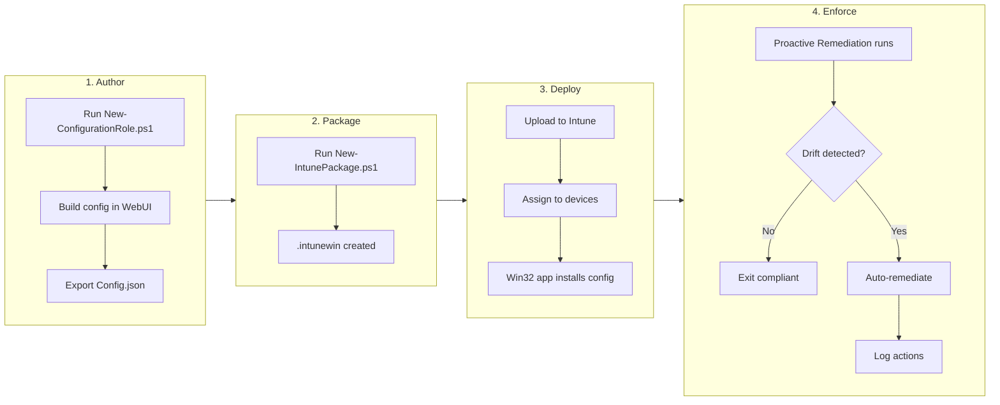

# Configuration Blender

**Devices drift. We can't see it. We can't fix it automatically. This changes that.**

Today, workstations are managed through a mix of LGPO, GPO, Intune policies, and SCCM baselines. None of these tell us when a device has drifted from its intended configuration. When autologon breaks, a printer disappears, a shortcut goes missing, or a certificate expires, we find out through an incident. Technicians spend hours manually fixing problems that could be detected and corrected automatically.

Configuration Blender adds a detection and self-healing layer that runs alongside existing tools. Role-owning teams define what their devices should look like. Windows Engineering deploys it. Devices fix themselves.

---

| Responsibility | Owner |
|----------------|-------|
| Define and maintain configuration | Role-owning team |
| Change control and approval | Role-owning team |
| Packaging and deployment | Intune team (fully automatable) |
| Detection and remediation engine | Intune team (configure once, runs automatically) |

---

**How it works:**

1. **Author** - Role team creates configuration using the web-based builder
2. **Package** - PowerShell script generates Intune-ready `.intunewin` file
3. **Deploy** - Upload to Intune and assign to device groups
4. **Enforce** - Proactive Remediation detects drift and auto-corrects

*Steps in Deploy are manual during initial rollout. This tool is designed for full CI/CD automation. Future state: role team commits changes, Azure workflows handle packaging and deployment automatically. This reduces mean time to remediation, eliminates manual handoffs, and ensures devices return to desired state faster.*

---

**What this tool does:**
- Detects configuration drift that existing tools don't monitor
- Automatically corrects drift when possible
- Reduces incidents for autologon, printers, shortcuts, certificates, scheduled tasks, and more
- Gives role teams ownership of their configurations

**What this tool does not do:**
- Replace Intune policies, SCCM baselines, LGPO, or GPO
- Manage configurations outside its defined checks

---

For technical implementation details, see [DOCUMENTATION.md](DOCUMENTATION.md).

---

**Developed by:** Joshua Walderbach, Windows Engineering
